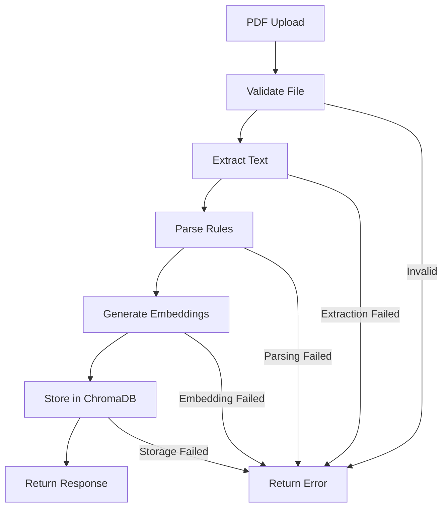

# Data Quality ChromaDB Generation & PDF Upload Documentation

## Overview

This documentation outlines the future implementation plan for migrating from the current `all-MiniLM-L6-v2` embedding model to `nomic-embed-text` (Ollama) and implementing a PDF upload endpoint for dynamic ChromaDB population.

## Current State vs Future State

### 🔄 Current Implementation
- **Embedding Model**: `all-MiniLM-L6-v2` (sentence-transformers)
- **Data Source**: Static CSV file (`dqrules.csv`)
- **Population**: Automatic on startup if collection is empty
- **Storage**: ChromaDB persistent storage at `chroma_db_dq_rules`

### 🚀 Future Implementation
- **Embedding Model**: `nomic-embed-text` (Ollama)
- **Data Sources**: CSV files + PDF documents
- **Population**: On-demand via API endpoints
- **Enhanced Features**: PDF text extraction, batch processing, progress tracking

## Migration Plan

### Phase 1: Embedding Model Migration

### Phase 1: Embedding Model Migration

#### Current DQ Rule Manager Integration
The existing `DQRuleManager` in `app/services/dq_rule_manager.py` currently uses:
```python
# Current implementation
from sentence_transformers import SentenceTransformer
self.embedding_model = SentenceTransformer(settings.EMBEDDING_MODEL_NAME)

# For rule population
embeddings = self.embedding_model.encode(documents, show_progress_bar=True)

# For query embedding  
query_embedding = self.embedding_model.encode(query).tolist()
```

#### Future Implementation with Nomic
See **[Nomic Embedding Migration Guide](./nomic_embedding_migration.md)** for complete implementation details:
```python
# Future implementation  
from langchain_community.embeddings import OllamaEmbeddings
self.embedding_model = OllamaEmbeddings(model="nomic-embed-text")

# For rule population (batch processing)
embeddings = self.embedding_model.embed_documents(documents)

# For query embedding
query_embedding = self.embedding_model.embed_query(query)
```

#### Migration Benefits
- **Better Semantic Understanding**: Nomic provides superior context understanding for data quality rules
- **Consistency**: Same embedding model used across the entire application  
- **Ollama Integration**: Centralized embedding service with the rest of the LLM infrastructure
- **Future-Proof**: Easier to upgrade to newer embedding models through Ollama

#### 1.1 Configuration Updates
```python
# app/core/config.py
class Settings(BaseSettings):
    # Current
    EMBEDDING_MODEL_NAME: str = "all-MiniLM-L6-v2"
    
    # Future - Replace with:
    EMBEDDING_MODEL_NAME: str = "nomic-embed-text"
    EMBEDDING_MODEL_PROVIDER: str = "ollama"  # New field
    OLLAMA_BASE_URL: str = "http://localhost:11434"  # New field
```

#### 1.2 Service Layer Updates
```python
# app/services/dq_rule_manager.py
# Replace SentenceTransformer with OllamaEmbeddings
from langchain_community.embeddings import OllamaEmbeddings

class DQRuleManager:
    def __init__(self, settings: Settings):
        # Current
        self.embedding_model = SentenceTransformer(settings.EMBEDDING_MODEL_NAME)
        
        # Future - Replace with:
        self.embedding_model = OllamaEmbeddings(
            model=settings.EMBEDDING_MODEL_NAME,
            base_url=settings.OLLAMA_BASE_URL
        )
```

### Phase 2: PDF Upload Endpoint Implementation

## API Endpoint Specification

### 📁 POST `/api/v1/dq-rules/upload-pdf`

#### Purpose
Upload PDF documents containing data quality rules and automatically extract, process, and store them in ChromaDB.

#### Request Format
```http
POST /api/v1/dq-rules/upload-pdf
Content-Type: multipart/form-data

--boundary
Content-Disposition: form-data; name="file"; filename="dq_rules.pdf"
Content-Type: application/pdf

[PDF binary data]
--boundary
Content-Disposition: form-data; name="domain"

Finance
--boundary
Content-Disposition: form-data; name="sap_module"

FI-GL
--boundary
Content-Disposition: form-data; name="batch_size"

32
--boundary--
```

#### Request Parameters

| Parameter | Type | Required | Description | Default |
|-----------|------|----------|-------------|---------|
| `file` | File | ✅ Yes | PDF file containing DQ rules | - |
| `domain` | String | ❌ No | Domain classification for rules | "General" |
| `sap_module` | String | ❌ No | SAP module classification | "General" |
| `batch_size` | Integer | ❌ No | Batch size for processing | 32 |
| `overwrite` | Boolean | ❌ No | Overwrite existing rules with same ID | false |

#### Response Format

**Success Response (200)**:
```json
{
  "status": "success",
  "message": "PDF processed successfully",
  "data": {
    "filename": "dq_rules.pdf",
    "total_pages": 25,
    "extracted_rules": 147,
    "successfully_stored": 145,
    "duplicates_skipped": 2,
    "processing_time_seconds": 12.5,
    "batch_count": 5,
    "collection_total_count": 720
  }
}
```

**Error Response (400/500)**:
```json
{
  "status": "error",
  "message": "Failed to process PDF",
  "error_details": {
    "error_type": "PDFExtractionError",
    "description": "Unable to extract text from PDF pages 5-7",
    "suggestions": [
      "Ensure PDF is not password protected",
      "Verify PDF contains extractable text (not just images)"
    ]
  }
}
```

#### Processing Flow



## Implementation Components

### 1. PDF Text Extraction Service
```python
# app/services/pdf_extraction_service.py
from PyPDF2 import PdfReader
from typing import List, Dict, Any
import logging

class PDFExtractionService:
    """Service for extracting text and rules from PDF documents."""
    
    def extract_text_from_pdf(self, file_path: str) -> List[str]:
        """Extract text from each page of the PDF."""
        
    def parse_rules_from_text(self, text: str, domain: str, sap_module: str) -> List[Dict[str, Any]]:
        """Parse structured rules from extracted text using LLM."""
        
    def validate_pdf_file(self, file) -> bool:
        """Validate uploaded PDF file."""
```

### 2. Enhanced DQ Rule Manager
```python
# app/services/dq_rule_manager.py (Enhanced)
class DQRuleManager:
    """Enhanced DQ Rule Manager with PDF support."""
    
    def add_rules_from_pdf(
        self, 
        pdf_file, 
        domain: str = "General",
        sap_module: str = "General",
        batch_size: int = 32,
        overwrite: bool = False
    ) -> Dict[str, Any]:
        """Process PDF and add rules to ChromaDB."""
        
    def batch_add_rules(
        self, 
        rules: List[Dict[str, Any]], 
        batch_size: int = 32
    ) -> Dict[str, Any]:
        """Add multiple rules in batches with progress tracking."""
```

### 3. API Endpoint Implementation
```python
# app/api/v1/endpoints/dq_chroma_genration/upload_endpoint.py
from fastapi import APIRouter, UploadFile, File, Form, Depends, HTTPException
from app.services.dq_rule_manager import DQRuleManager
from app.services.pdf_extraction_service import PDFExtractionService

router = APIRouter()

@router.post("/upload-pdf")
async def upload_pdf_rules(
    file: UploadFile = File(...),
    domain: str = Form("General"),
    sap_module: str = Form("General"),
    batch_size: int = Form(32),
    overwrite: bool = Form(False),
    dq_manager: DQRuleManager = Depends(get_dq_rule_manager),
    pdf_service: PDFExtractionService = Depends(get_pdf_extraction_service)
):
    """Upload and process PDF containing DQ rules."""
```

### 4. Progress Tracking & WebSocket Support
```python
# app/api/v1/endpoints/dq_chroma_genration/progress_endpoint.py
from fastapi import WebSocket
import asyncio

@router.websocket("/upload-progress/{upload_id}")
async def upload_progress(websocket: WebSocket, upload_id: str):
    """WebSocket endpoint for real-time upload progress."""
    await websocket.accept()
    # Stream progress updates during PDF processing
```

## File Structure

```
app/api/v1/endpoints/dq_chroma_genration/
├── README.md                      # Main documentation (this file)
├── chroma_dq_genration.py        # Current batch generation script (nomic-embed-text)
├── upload_endpoint.md            # Future PDF upload endpoint documentation
├── progress_endpoint.md          # Future progress tracking endpoint documentation
├── schemas.md                    # Pydantic schemas documentation
├── nomic_embedding_migration.md  # Migration guide for embedding models
└── (future implementation files)
    ├── upload_endpoint.py        # PDF upload endpoint implementation
    ├── progress_endpoint.py      # Progress tracking implementation
    └── schemas.py               # Pydantic schemas implementation
```

## Dependencies to Add

### Python Packages
```bash
# PDF processing
pip install PyPDF2 pdfplumber

# Enhanced text extraction (optional)
pip install pytesseract  # For OCR if needed

# Progress tracking
pip install python-multipart  # For file uploads
```

### Ollama Setup
```bash
# Install Ollama
curl -fsSL https://ollama.ai/install.sh | sh

# Pull the nomic-embed-text model
ollama pull nomic-embed-text
```

## Related Documentation

### 📚 Additional Documentation Files

1. **[Nomic Embedding Migration Guide](./nomic_embedding_migration.md)**
   - Detailed migration steps from `all-MiniLM-L6-v2` to `nomic-embed-text`
   - Query embedding implementation for DQ rule finding
   - Error handling and fallback strategies
   - Performance optimization techniques

2. **[Upload Endpoint Implementation](./upload_endpoint.md)**
   - Complete PDF upload endpoint specification
   - Background processing with progress tracking
   - Error handling and validation

3. **[Progress Tracking WebSocket](./progress_endpoint.md)**
   - Real-time progress updates via WebSocket
   - Client examples in JavaScript and Python
   - Connection management and cleanup

4. **[Request/Response Schemas](./schemas.md)**
   - Pydantic models for API validation
   - Example requests and responses
   - Error response formats

## Configuration Migration

### Environment Variables
```bash
# Current
API2_EMBEDDING_MODEL_NAME=all-MiniLM-L6-v2

# Future
API2_EMBEDDING_MODEL_NAME=nomic-embed-text
API2_EMBEDDING_MODEL_PROVIDER=ollama
API2_OLLAMA_BASE_URL=http://localhost:11434
```

## Testing Strategy

### Unit Tests
- PDF text extraction accuracy
- Rule parsing validation
- Embedding generation consistency
- ChromaDB storage integrity

### Integration Tests
- End-to-end PDF upload flow
- Batch processing performance
- Error handling scenarios
- Progress tracking accuracy

### Performance Tests
- Large PDF processing (100+ pages)
- Concurrent upload handling
- Memory usage optimization
- Embedding generation speed comparison

## Migration Checklist

### Pre-Migration
- [ ] Install Ollama and pull `nomic-embed-text` model
- [ ] Backup existing ChromaDB data
- [ ] Prepare test PDF documents
- [ ] Update configuration files

### Migration Steps
- [ ] Update embedding service to use Ollama
- [ ] Implement PDF extraction service
- [ ] Create upload endpoint
- [ ] Add progress tracking
- [ ] Update API documentation
- [ ] Perform comprehensive testing

### Post-Migration
- [ ] Monitor embedding quality
- [ ] Compare performance metrics
- [ ] Validate rule retrieval accuracy
- [ ] Update client applications

## Benefits of Migration

### 🎯 Technical Benefits
- **Better Embeddings**: Nomic-embed-text provides superior semantic understanding
- **Local Processing**: No external API dependencies for embeddings
- **Cost Efficiency**: No per-token charges for embedding generation
- **Flexibility**: Support for multiple document formats

### 🚀 Functional Benefits
- **Dynamic Rule Addition**: Upload rules without system restart
- **Batch Processing**: Efficient handling of large documents
- **Progress Tracking**: Real-time upload status
- **Validation**: Automatic rule format validation

### 📊 Operational Benefits
- **Reduced Downtime**: Hot-swappable rule updates
- **Better Monitoring**: Detailed processing metrics
- **Error Recovery**: Robust error handling and retry logic
- **Scalability**: Support for concurrent uploads

## Future Enhancements

### Phase 3: Advanced Features
- **OCR Support**: Extract text from image-based PDFs
- **Multi-format Support**: Excel, Word, JSON rule files
- **Rule Versioning**: Track rule changes over time
- **Approval Workflow**: Review rules before adding to ChromaDB

### Phase 4: Enterprise Features
- **Authentication**: User-based rule uploads
- **Audit Trail**: Complete change history
- **Role-based Access**: Different permissions for rule management
- **Integration APIs**: Connect with external rule repositories
