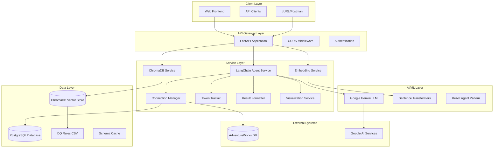
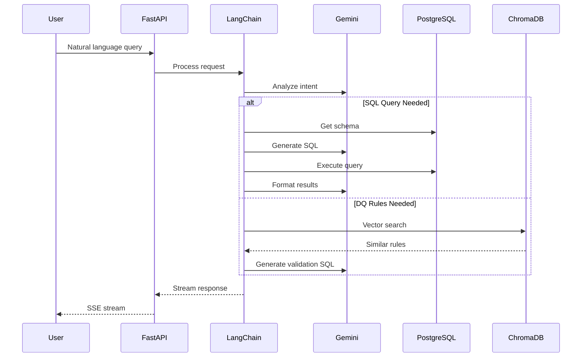
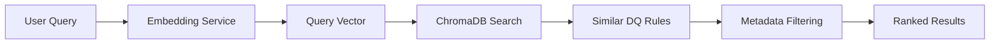

# Brain LLM - System Architecture & Product Overview

## 📋 Table of Contents
- [Product Overview](#product-overview)
- [System Architecture](#system-architecture)
- [Core Components](#core-components)
- [Data Flow](#data-flow)
- [Technology Stack](#technology-stack)
- [API Architecture](#api-architecture)
- [Database Schema](#database-schema)
- [Security & Performance](#security--performance)
- [Deployment Architecture](#deployment-architecture)

---

## 🎯 Product Overview

### Mission Statement
Brain LLM is an intelligent SQL query generation and data quality management system that bridges the gap between natural language queries and database operations. It leverages Large Language Models (LLMs) to transform business questions into accurate SQL queries while ensuring data quality through automated rule validation.

### Key Features
- **🧠 Natural Language to SQL**: Convert plain English questions into optimized SQL queries
- **📊 Data Quality Management**: Automated DQ rule discovery and validation from a comprehensive rule repository (600+ rules)
- **🔄 Real-time Streaming**: Server-Sent Events (SSE) for live query processing feedback
- **📈 Smart Visualization**: Automatic generation of entity relationship diagrams and data visualizations
- **💬 Conversational Interface**: Context-aware chat functionality for iterative query refinement
- **🎯 Token Usage Tracking**: Comprehensive monitoring of LLM token consumption across all operations
- **🔍 Vector Search**: Semantic similarity matching for DQ rules using ChromaDB

### Target Users
- **Business Analysts**: Query databases without SQL knowledge
- **Data Engineers**: Validate data quality and discover relevant DQ rules
- **Database Administrators**: Monitor query patterns and optimize database performance
- **Data Scientists**: Explore data relationships and generate insights

---

## 🏗️ System Architecture



### Architecture Principles

1. **Microservices-Oriented**: Modular services with clear separation of concerns
2. **Event-Driven**: Real-time streaming with Server-Sent Events
3. **AI-First**: LLM-powered decision making and query generation
4. **Vector-Enhanced**: Semantic search capabilities for rule matching
5. **Schema-Agnostic**: Dynamic database schema discovery and caching
6. **Observable**: Comprehensive logging and token usage tracking

---

## 🔧 Core Components

### 1. LangChain Agent Service (`langchain_service.py`)
**Purpose**: Central orchestration engine implementing ReAct (Reasoning + Acting) pattern

**Key Features**:
- Multi-tool agent with 4 specialized tools
- Real-time streaming of agent thoughts and actions
- Conversational memory management
- Token usage accumulation across all LLM calls

**Tools Available**:
```python
1. sql_workflow: Natural language → SQL → Execution → Formatting
2. query_dq_rules: Semantic DQ rule discovery and validation
3. generate_visualization: ER diagram and relationship mapping
4. conversational_response: Direct chat interactions
```

### 2. Vector Database Service (`chroma_service.py`)
**Purpose**: Semantic search and similarity matching using ChromaDB

**Capabilities**:
- 600+ DQ rules vectorized and indexed
- Similarity search with configurable thresholds
- Persistent vector storage
- Metadata filtering and result ranking

### 3. Connection Manager (`connection_manager.py`)
**Purpose**: Database connectivity and schema management

**Features**:
- Dynamic schema discovery and caching
- Multi-database support (PostgreSQL, AdventureWorks)
- Connection pooling and health monitoring
- Automatic schema refresh mechanisms

### 4. Token Tracking System (`token_tracker.py`)
**Purpose**: Monitor and optimize LLM usage costs

**Tracking Scope**:
- Request-scoped token accumulation
- Per-tool token consumption analysis
- Prompt vs response token breakdown
- Multi-call aggregation within single requests

### 5. Embedding Service (`embedding_service.py`)
**Purpose**: Text-to-vector conversion for semantic operations

**Models**:
- Sentence Transformers for high-quality embeddings
- Configurable embedding dimensions
- Batch processing for efficiency

---

## 🌊 Data Flow

### Query Processing Flow


### Vector Search Flow


---

## 💻 Technology Stack

### Backend Framework
- **FastAPI**: High-performance async web framework
- **Pydantic**: Data validation and settings management
- **Uvicorn**: ASGI server for production deployment

### AI/ML Components
- **LangChain**: Agent orchestration and tool management
- **Google Gemini**: Primary LLM for text generation
- **Sentence Transformers**: Text embedding models
- **ChromaDB**: Vector database for semantic search

### Database Technologies
- **PostgreSQL**: Primary relational database
- **ChromaDB**: Vector storage with HNSW indexing
- **SQLite**: Embedded storage for ChromaDB

### Data Processing
- **Pandas**: Data manipulation and analysis
- **BeautifulSoup4**: HTML parsing for result formatting
- **Tabulate**: Table formatting for readable output

### Infrastructure
- **Python 3.12+**: Core runtime environment
- **JSON Logging**: Structured logging for monitoring
- **Environment Variables**: Configuration management

---

## 🔌 API Architecture

### Endpoint Structure
```
/api/v1/
├── /query          # Main query processing endpoint
├── /generate       # Direct text generation
├── /health         # Health check endpoint
└── /docs           # OpenAPI documentation
```

### Key Endpoints

#### 1. Query Processing Endpoint
```http
POST /api/v1/query
Content-Type: application/json

{
    "query": "Show me sales data for last quarter",
    "database_name": "AdventureWorks",
    "conversation_id": "uuid-string"
}
```

**Response**: Server-Sent Events stream
```
data: {"type": "status_update", "content": "Analyzing query..."}
data: {"type": "structured_response", "sql": "SELECT ...", "results": [...]}
data: {"type": "token_usage", "prompt_tokens": 150, "response_tokens": 300}
```

#### 2. Text Generation Endpoint
```http
POST /api/v1/generate
Content-Type: application/json

{
    "prompt": "Explain this SQL query",
    "max_tokens": 500
}
```

### Streaming Architecture
- **Server-Sent Events (SSE)**: Real-time communication
- **Event Types**: `status_update`, `structured_response`, `token_usage`
- **Chunked Transfer**: Efficient data streaming
- **Error Handling**: Graceful failure recovery

---

## 🗄️ Database Schema

### PostgreSQL Tables
```sql
-- Core business tables (AdventureWorks)
Tables:
├── Sales.SalesOrderHeader
├── Sales.SalesOrderDetail  
├── Person.Person
├── Person.Address
├── Production.Product
├── Production.ProductCategory
└── HumanResources.Employee
```

### ChromaDB Collections
```python
Collections:
├── dq_rules_collection     # Data Quality rules (600+ entries)
├── conversation_history    # Chat context storage
├── query_cache            # Cached query results
└── schema_embeddings      # Database schema vectors
```

### DQ Rules Structure
```csv
Columns:
├── Conversion Object Name  # Domain (Customer Master, Sales, etc.)
├── SAP Modules            # Business module classification
├── Data Type              # Master/Transaction/Reference
├── Rule #                 # Unique identifier
├── Profiling Rule Descriptions  # Natural language rule description
├── Quality Dimension      # Completeness/Consistency/Conformity/etc.
└── Attribute Group        # Logical grouping (Address, Payment, etc.)
```

---

## 🔐 Security & Performance

### Security Measures
- **API Key Management**: Environment-based configuration
- **CORS Configuration**: Controlled cross-origin access
- **Input Validation**: Pydantic-based request validation
- **SQL Injection Prevention**: Parameterized queries
- **Rate Limiting**: Request throttling (configurable)

### Performance Optimizations
- **Schema Caching**: In-memory database schema storage
- **Vector Indexing**: HNSW algorithm for fast similarity search
- **Async Processing**: Non-blocking I/O operations
- **Connection Pooling**: Efficient database connection management
- **Token Optimization**: Smart prompt engineering to reduce costs

### Monitoring & Observability
- **Structured Logging**: JSON-formatted logs for analysis
- **Token Usage Tracking**: Real-time cost monitoring
- **Health Checks**: System availability monitoring
- **Error Tracking**: Comprehensive error logging and alerting

---

## 🚀 Deployment Architecture

### Development Environment
```yaml
Components:
├── FastAPI Development Server (uvicorn)
├── Local PostgreSQL instance
├── ChromaDB local persistence
├── Environment variables (.env)
└── Console + File logging
```

### Production Environment
```yaml
Infrastructure:
├── Load Balancer (nginx/ALB)
├── FastAPI Cluster (multiple instances)
├── PostgreSQL Cluster (primary/replica)
├── ChromaDB Distributed Setup
├── Redis Cache Layer
├── Monitoring Stack (Prometheus/Grafana)
└── Log Aggregation (ELK Stack)
```

### Scalability Considerations
- **Horizontal Scaling**: Multiple FastAPI instances behind load balancer
- **Database Scaling**: Read replicas for query workloads
- **Vector Search Scaling**: ChromaDB cluster for large rule sets
- **Caching Strategy**: Redis for frequently accessed data
- **CDN Integration**: Static asset delivery optimization

### Container Deployment
```dockerfile
# Production-ready containerization
FROM python:3.12-slim
COPY requirements.txt .
RUN pip install -r requirements.txt
COPY app/ /app/
EXPOSE 8000
CMD ["uvicorn", "app.main:app", "--host", "0.0.0.0", "--port", "8000"]
```

---

## 📊 System Metrics & KPIs

### Performance Metrics
- **Query Response Time**: < 2 seconds for simple queries
- **Streaming Latency**: < 100ms for first response chunk
- **Vector Search Speed**: < 50ms for similarity queries
- **Database Query Time**: < 500ms for complex joins

### Business Metrics
- **Query Success Rate**: > 95% successful SQL generation
- **DQ Rule Match Accuracy**: > 90% relevant rule discovery
- **Token Efficiency**: Optimized prompt engineering for cost reduction
- **User Satisfaction**: Contextual conversation quality

### Operational Metrics
- **System Uptime**: 99.9% availability target
- **Error Rate**: < 1% system errors
- **Resource Utilization**: CPU < 70%, Memory < 80%
- **Storage Growth**: Predictable vector storage scaling

---

## 🔮 Future Enhancements

### Planned Features
1. **Multi-LLM Support**: Integration with Claude, GPT-4, and other providers
2. **Advanced Caching**: Intelligent query result caching
3. **Custom DQ Rules**: User-defined data quality rule creation
4. **Visualization Dashboard**: Web-based query and monitoring interface
5. **Export Capabilities**: PDF/Excel report generation
6. **Webhook Integration**: Event-driven external system notifications

### Technical Roadmap
- **Database Support**: MySQL, Oracle, SQL Server connectors
- **Real-time Analytics**: Live dashboard for system metrics
- **ML Pipeline**: Automated query optimization based on usage patterns
- **Security Enhancements**: OAuth2, role-based access control
- **API Versioning**: Backward-compatible API evolution

---

*This document provides a comprehensive overview of the Brain LLM system architecture. For technical implementation details, refer to the individual service documentation and code comments.*

**Last Updated**: July 12, 2025  
**Version**: 1.0.0  
**Maintainer**: Brain LLM Development Team
